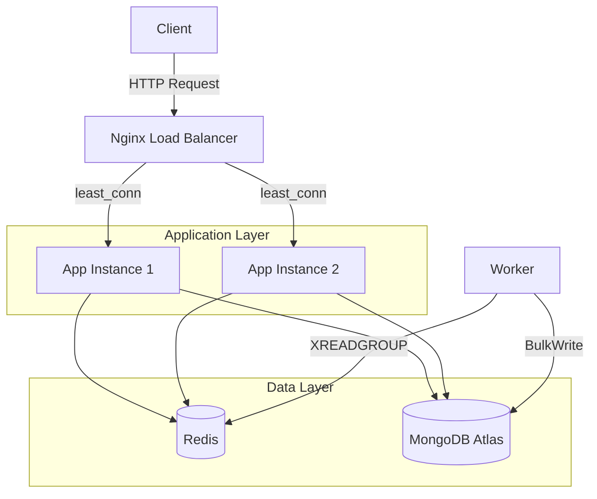

# TinyScale

TinyScale is a horizontally-scaled, high-performance URL shortener backend designed to handle high concurrency with zero-collision Base62 codes, atomic rate limiting, and decoupled asynchronous click tracking.

---

## System Architecture

The diagram below details the end-to-end request lifecycle and component interaction:



---

## Tech Stack

| Layer | Technologies | Description |
| --- | --- | --- |
| **Reverse Proxy & Load Balancer** | Nginx | Distributes client requests across application instances using a least-connections (`least_conn`) strategy. |
| **Application Layer** | Node.js, Express.js | Asynchronous core servers handling REST API requests. |
| **Cache, Rate Limiter & Queue** | Redis | Powering atomic Lua-based rate limiting, cache-aside redirection caching, and the asynchronous event stream buffer (`click_events`). |
| **Primary Database** | MongoDB Atlas | External MongoDB database storing URL mappings and auto-increment sequence counters. |
| **Background Processing** | Node.js Worker | Decoupled background service consuming streams using consumer groups and committing bulk updates to MongoDB. |

---

## Load Testing Benchmarks

The stack was benchmarked using `autocannon` with a concurrency load of **50 concurrent connections** (and **200 connections** for rate limiting) against the Docker Compose deployment.

### Key Performance Numbers

| Scenario | Description | Requests/Sec | p50 Latency | p97.5 Latency | Result |
| --- | --- | --- | --- | --- | --- |
| **Scenario A** | Redirect (Cache Warm) | 449.80 | 103 ms | 201 ms | **100% Cache Hits** (8,996 successful `302 Found` redirects) |
| **Scenario B** | Redirect (Cold/No Cache) | 1.00 | 88 ms | 88 ms | **1 Cache Miss** (1 request with full DB query and Redis write) |
| **Scenario C** | Shorten URL (Write Path) | 40.21 | 1116 ms | 2048 ms | **100% Writes** (804 unique URLs shortened and stored in MongoDB) |
| **Scenario D** | Rate Limit Behavior | 368.20 | 476 ms | 1437 ms | **99.5% Rate Limited** (3,664 `429 Too Many Requests` responses served) |

*Note: Raw outputs of the benchmarks are stored in `results/benchmark-results.txt`.*

---

## Design Decisions

### 1. Counter-Based Base62 Encoding over Hashing
Instead of generating random string hashes (e.g. SHA-256 or MD5) which are prone to collisions and require expensive database retry/lookup loops, TinyScale uses a centralized, atomic MongoDB counter sequence. The integer sequence is encoded to Base62 (using `0-9`, `a-z`, `A-Z`), guaranteeing:
*   **100% collision-free** code generation.
*   **Shortest possible URLs** (starting from 1-character length like `/1`, `/2` rather than a fixed 7-character hash).
*   High efficiency without retry logic in code.

### 2. Cache-Aside Pattern over Write-Through Caching
When a URL is shortened, the entry is written only to MongoDB. It is not pushed to the Redis cache immediately (Cache-Aside pattern). This keeps the write path (`/shorten`) fast and prevents bloating the cache with URLs that may never be visited. Upon the first redirect request for a code (cache miss), the app fetches the destination URL from MongoDB and caches it in Redis with an expiration TTL (3600 seconds), making subsequent visits near-instantaneous.

### 3. Lua Script for Rate Limiting Atomicity
The client rate limiter is built on an IP-based token bucket algorithm. Performing the rate-limit checks (getting bucket state, calculating token refill based on time elapsed, checking if token is available, decrementing, and saving the state) as separate Redis operations from the application code would introduce race conditions under concurrent requests. TinyScale compiles this logic into a single **Redis Lua Script** executed via `EVAL`. Redis executes Lua scripts atomically, preventing two simultaneous requests from the same IP from bypassing limits.

### 4. Redis Streams & Consumer Groups over Pub/Sub
To keep redirection latency low, click tracking is completely decoupled from the HTTP response. When a redirect occurs, the app sends a lightweight event to a Redis Stream named `click_events` using `XADD` (failing open if Redis is unavailable).
*   **Pub/Sub** is a fire-and-forget mechanism; if the worker goes offline, published clicks are permanently lost.
*   **Redis Streams** persist the events. Using **Consumer Groups** (`XREADGROUP`) ensures that even if multiple worker containers are scaled, each event is processed exactly once. In the case of a worker crash, the restarted worker can query the Pending Entries List (PEL) via ID `0` to process and acknowledge (`XACK`) orphaned events, guaranteeing **zero click data loss**.

---

## Setup and Running

### 1. Local Environment Configuration
Create a `.env` file in the root directory:
```env
MONGO_URL=mongodb+srv://<username>:<password>@<cluster>.mongodb.net/tinyscale
PORT=3000
BASE_URL=http://localhost:3000
REDIS_URL=redis://localhost:6379
```

### 2. Docker Compose Deployment (Recommended)
Run the entire production stack (App instances, Nginx load balancer, Redis, and Streams worker) with one command:
```bash
docker compose up -d --build
```
This boots:
*   `app1` and `app2` running the API servers on internal port `3000`.
*   `nginx` reverse proxy exposing port `80` to the host and load-balancing traffic.
*   `redis` service running Redis on port `6379`.
*   `worker` background queue worker consuming click events.

### 3. Running Benchmarks
Ensure the stack is running, then run the load tests locally:
```bash
npm install
npm run benchmark
```
The script will perform the testing sequences, generate metrics, and write them to `results/benchmark-results.txt`.
